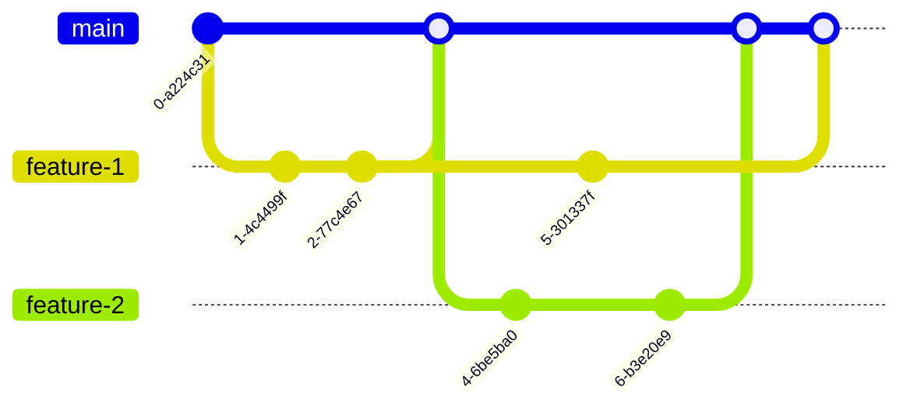

# 설치 및 실행
0. Node.js(18v 이상, 최신 LTS 권장), npm 설치
1. git clone
```sh
git clone https://github.com/emonga-dev/emonga-dev.github.io.git
```
2. 의존성 설치
```sh
cd path/to/emonga-dev.github.io.git

npm install
```
3. Lint 설정
    - `eslint.config.js`에 lint rule 정의되어 있음.
    - 사용하는 IDE에 맞게 설정하기
4. 실행
```sh
npm run dev
```
5. 빌드 및 배포
```sh
npm run build     # 로컬에서 빌드할 때 사용. PR 생성 전 빌드 테스트하기!
npm run deploy    # gh-pages 브랜치에 빌드 파일 생성 및 배포
```
# Contributing
## 브랜칭 전략

- 메인 브랜치: `main`
    - `main` 브랜치 기준으로 테스트 및 배포
- 배포 브랜치: `gh-pages`
- 채번된 issue number 기준으로 브랜치 생성
    - PR 생성(-> `main`)하여 리뷰 진행, 반영
### 브랜치 네이밍
- 예시: `17/feature/project-detail`
    - `17`: Github Issue 번호 (#17)
    - `feature`: 작업 종류 (기능 개발)
    - `project-detail`: 작업에 대한 간단한 요약 (1~3 words)
## 커밋 메시지 컨벤션
### 템플릿
```
<타입>: <한 줄 제목>(<issue number>)

- 수정 항목 1
- 수정 항목 2
- 수정 항목 3
```
- 제목에 issue number를 달면 Github Issues와 연동되어 이슈 트래킹이 용이해집니다.
- 제목으로 커밋에 대한 설명이 충분히 된다면 세부 항목은 작성하지 않아도 됩니다.
- 세부 항목에 `closes #n` 등을 적으면 issue가 자동으로 close됩니다.
### 추천 접두어

| 접두어        | 의미                       |
| ---------- | ------------------------ |
| `feat`     | 새로운 기능 추가                |
| `fix`      | 버그 수정                    |
| `docs`     | 문서 관련 작업                 |
| `refactor` | 리팩토링 (기능 변화 없음)          |
| `test`     | 테스트 코드 추가/수정             |
| `chore`    | 빌드, 설정, 패키지 관리 등 기타 작업   |
| `style`    | 포맷팅, 세미콜론 제거 등 코드 스타일 수정 |
### 예시: react-i18n 적용
```
feature: apply react-i18n (#2)

- 패키지 설치
- mock component for toggling language
- closes #2
```
> 내용은 영어로 쓰든 한국어로 쓰든 상관 없습니다.
## GitHub Issues / Project
### Kanban Board
- 작업 티켓과 진행 상황을 [칸반보드](https://github.com/users/emonga-dev/projects/1)에서 확인하세요.
### 이슈 생성하기
- 작업을 subtask로 쪼개거나, 새로운 작업을 직접 생성하세요.
- 이슈 라벨을 지정하세요.
    - `develop`: 기능 개발
    - `bug`: 버그 수정
    - `chore`: 기타 (프로그래밍과 많은 관계가 없는) 업무
    - `design`: 설계
    - `documentation`: 문서화
    - `refactor`: 리팩터
    - `style`: css 등 스타일만을 변경
### 작업하기
1. 이슈를 확인하고 브랜치를 생성하세요.
    - `git checkout -b branch-name`
    - 작업을 시작하면 issue의 상태를 `In Progress`로 변경하세요.
2. 커밋 메시지 컨벤션을 지켜주세요.
    - `feature: 프로젝트 카드에 hover 효과 추가`
3. Pull Request를 보내고 리뷰를 요청하세요.
    - 리뷰 후 PR이 승인되고 메인 브랜치에 merge되면 issue의 상태를 `Done`으로 변경하세요.
## 코드 컨벤션
- Lint rule을 기반으로 코드를 작성합니다.
## 네이밍 컨벤션
- 자명한 약어(e.g. `yn`(yes / no))를 제외하고는 축약어를 사용하지 않습니다.
    - 축약어를 적절하게 사용하여 가독성을 높일 수 있다면 사용해도 좋습니다.
- `boolean` 변수명의 prefix로 'is'나 'has'를 붙이는 것을 권장합니다.
    - ex) `const isMultiple: boolean;`
- 긴 변수명들이 서로 비슷하다면 첫 단어를 다르게 하는 것을 권장합니다.
```ts  
// 권장 X
const messageInternalError: string;  
const messageNotFound: string;  
  
// 권장 O
const internalErrorMessage: string;  
const notFoundMessage: string;  
```  
> 🔸컨벤션을 반드시 지킬 필요는 없고, 상황에 따라 적절히 네이밍하면 됩니다.

# Architecture (Tentative)
>‼️확정된 사안은 없습니다. (계속 변경될 예정입니다.)
## 타입 정의
```ts
type tag = 'branding' | 'figma';  // 디자이너와의 소통 후 추가될 예정

// 포트폴리오에 대한 모델링
type Project = {  
    slug: string;             // 포트폴리오의 슬러그  
    tags: tag[];              // 해당 포트폴리오의 태그 목록  
    representative?: string;  // 포트폴리오의 대표 이미지 경로  
};

export const projects: Project[] = [ ... ];
```
## 라우팅 구조

# 협업 룰
- 소통하세요.
    - 궁금한 점, 논의할 사항이 있으면 언제든 편한 방법으로 소통하세요.
- 추진하세요.
    - 변경에 주저하지 마세요.
        - 기존에 ... 되어있다고 해서 똑같이 할 필요는 없습니다. (디렉터리 구조, 로직 등)
        - 더 나은 방법이 있으면 제안하고 변경하세요!
        - 필요한 의존성이 있으면 설치해서 사용하세요.
- 기록하세요.
    - 기억하려고 하지 마세요.
        - 나중에 ... 해야지 하면 잊어버리기 쉽습니다.
        - ticket을 생성하거나 메모를 comment로 작성하세요.
- 즐기세요.
    - '토이' 프로젝트입니다. 절대 스트레스 받지 말고 편하게 하세요. 😙
